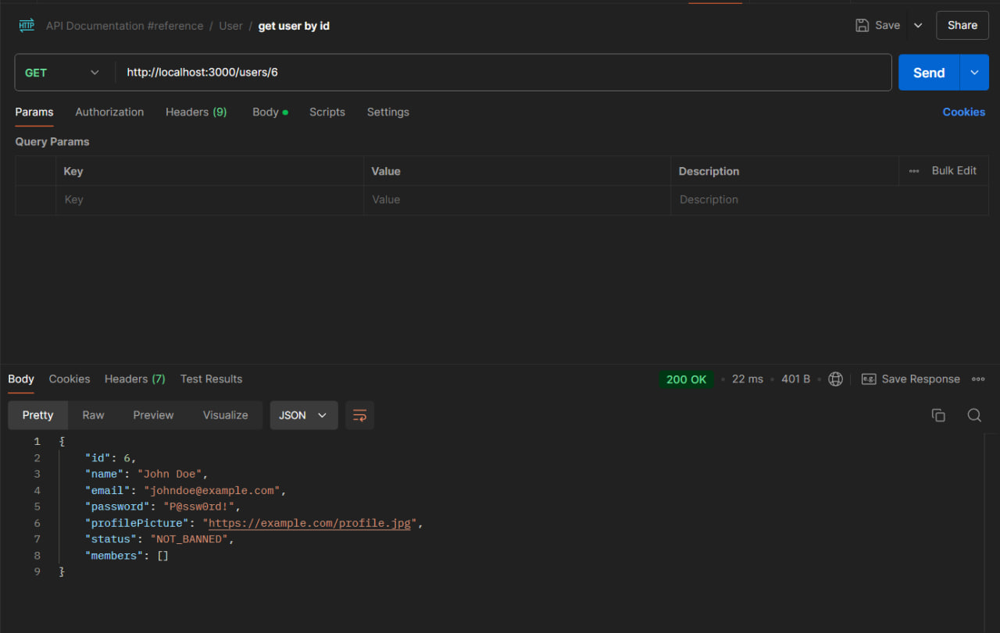

# Тестування працездатності системи

### Запуск сервера

```bash
npm run start:dev
```


### Users

**GET /users**


**POST /users**


**GET /users/:id**



**PATCH /users/:id**

.png>)

**DELETE /users/:id**


### Task

**GET /tasks**


**POST /tasks**


**GET /tasks/:id**


**PATCH /tasks/:id**


.png>)

**DELETE /tasks/:id**


### Project

**GET /projects**


**POST /projects**


**GET /projects/:id**


**PATCH /projects/:id**


**DELETE /projects/:id**


### Exceptions

#### Users

**POST /users**


**GET /users/:id**


**PATCH /users/:id**


**DELETE /users/:id**

.png>)

#### Tasks

**POST /tasks**


**GET /tasks/:id**


**PATCH /tasks/:id**


**DELETE /tasks/:id**


#### Projects

**POST /projects**


**GET /projects/:id**


**PATCH /projects/:id**


**DELETE /projects/:id**


